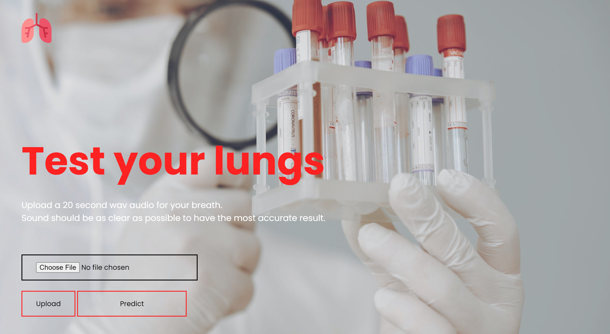
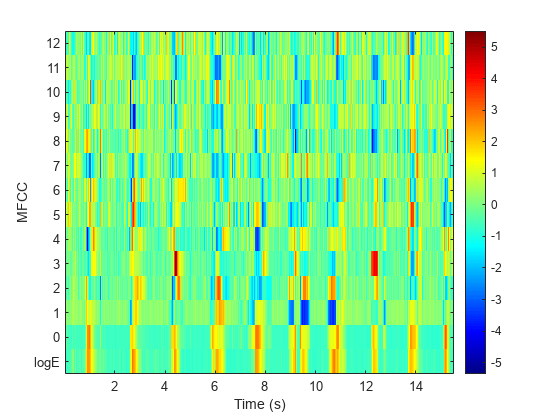

# Test your lungs
The project is attempt to classify respiratory diseases using CNN with MFFCs as an input. The database used is a collection of respiratory sounds recorded using digital stethoscopes. The used dataset is [Respiratory Sound Database](https://www.kaggle.com/datasets/vbookshelf/respiratory-sound-database) on Kaggle.  

* MFCCs as input features for a CNN as it is treated as a 2D image-like structure.  

* labels are handled using one-hot encoding
* a sequential model consisting of 9 layers, including 4 convolutional layers, 4 pooling layers, and 1 dense layer
  * first layer's input is (40, 862, 1) based with MFFCs feature extraction
  * activation layer is ReLU
  * a dropout value of 0.2 and MaxPooling2D are added to reduce training time and overfitting
  * last layer have softmax activation function and 6 nodes (num\_labels)
Then, the model were deployed using flask in web application that takes the audio as an input and outputs the most likely diseases and whether the results require a medical checkup or not.
